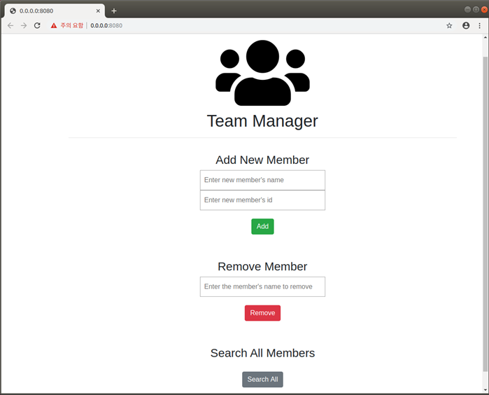

# Team Manager

Simple team management system, **Team Manager** in Hyperledger Fabric v1.4

## Components
There are two organizations which have one peer each, one orderer and one CA. Two peers are joining in *mychannel*.

## Chaincode
Developed in **Go**
### 1. Data Structure
Each structure consists of **member's name** and **member's id**.
```
type MemberInfo struct {
    Name string `json:"name"`
    Id string `json:"id"`
}
```

### 2. Functions
- addMember : add new member
```
func (s *SmartContract) addMember(APIstub shim.ChaincodeStubInterface, args []string) sc.Response {}
```
- removeMember : remove the member in the database
```
func (s *SmartContract) removeMember(APIstub shim.ChaincodeStubInterface, args []string) sc.Response {}
```
- readAllMembers : query all members in the database
```
func (s *SmartContract) readAllMembers(APIstub shim.ChaincodeStubInterface) sc.Response {}
```

## How to Run

### 1. Install Hyperledger Fabric v1.4
- [Installation](https://hyperledger-fabric.readthedocs.io/en/release-1.4/getting_started.html)

### 2. download team-manager repository in the fabric-samples directory
```
cd fabric-samples
git clone https://github.com/sinseon-lee/team-manager
```

### 3. run generate.sh to create things to start the hyperledger fabric network in the network directory
```
cd network
./generate.sh
```

### 4. run start.sh to start the hyperledger fabric network in the network directory
```
./start.sh
```

### 5. run cc.sh to install and instantiate the chaincode
```
./cc.sh instantiate v1.0
```

To test the chaincode, enter these example commands below.
```
# test addMember
docker exec cli peer chaincode invoke -n team-manager -C mychannel -c '{"Args":["addMember","Sinseon", "1"]}'
# test removeMember
docker exec cli peer chaincode invoke -n team-manager -C mychannel -c '{"Args":["removeMember","Sinseon"]}'
# test readAllMembers
docker exec cli peer chaincode query -n team-manager -C mychannel -c '{"Args":["readAllMembers"]}'
```

### 6. install modules for this system
```
cd ../application
npm install
```

### 7. run web.sh to start the web server
```
./web.sh
```


### 8. to stop this network, run teardown.sh in the network directory
```
cd ../network
./teardown.sh
```
